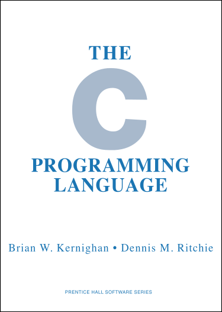
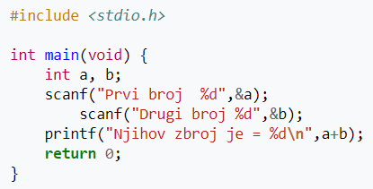
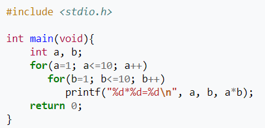

Programski jezik **C** spada u proceduralne programske jezike koji je razvijen u ranim 70-im godinama 20. stoljeća.

## Povijest razvoja

Autor ovog programskog jezika je Dennis Ritchie, no značajan doprinos nastanku C-a dali su Ken Thompson kao autor programskog jezika B i Martin Richards, autor programskog jezika BCPL. Dennis Ritchie je stvorio ovaj programski jezik za rješavanje praktičnih problema kodiranja sistemskih programa i jezgre operacijskog sustava UNIX, koji je praktički u cijelosti napisan u C-u.

Programski jezik C dosta se mijenjao tokom godina te je u više navrata neformalno i formalno standardiziran. Prva važnija inačica poznata je pod nazivom "K&R C", što je engl. kratica prezimena dvaju autora najpoznatijeg C priručnika "The C Programming Language", a to su Brian Kernighan i Dennis Ritchie. Prvo izdanje te vrlo sažeto i precizno pisane knjige koje datira iz 1978. godine ujedno je de facto standardiziralo jezik u 70-ima. Drugo izdanje iz 1988. godine opisuje "ANSI C", standard kojeg je 1983. godine definirao američki nacionalni institut za standardizaciju, a koji je i danas najbolje podržan. Donedavni je standard bio ISO/IEC standard skraćeno poznat kao "C99", no krajem 2011. usvojen je ISO/IEC 9899:2011, poznat kao "C11", za koji su kompajleri još u razvoju.

Kao jedan od najvažnijih jezika u povijesti komercijalne računalne industrije, C je do danas ostao jedini programski jezik prilagođen za sve računalne platforme, od malih sustava pa do mrežnih superračunala. Programi napisani u njemu vrlo su bliski načinu rada hardvera te u načelu zahtijevaju od programera dobro razumijevanje rada procesora, memorije, ulazno-izlaznih sklopova itd. No, rad s registrima procesora i adresiranje memorije apstrahirani su pomoću koncepta varijabli i pokazivača što uz eksplicitne kontrolne strukture i funkcije znatno olakšava programiranje u odnosu na izravno programiranje u strojnim jezicima.

## Proširivanje na objektno orijentirano programiranje

Tokom 1980-ih, Bjarne Stroustrup zajedno s drugim istraživačima u Bell Labs proširuje C dodavajući sposobnosti objektno orijentiranog programiranja, a naziv ovog novog programskog jezika je C++. Nažalost, takva kompatibilnost također podrazumijeva da su problemi koje programiranje u C-u nosi sa sobom naslijeđeni u C++-u. Efikasno i sigurno programiranje u C-u vrlo je zahtjevna vještina koja traži višegodišnje iskustvo pa je stoga C jezik koji se ne preporučuje početnicima, posebice ako im programiranje nije primarni posao.

## Uporaba

C je jezik opće namjene, što znači da se u njemu može napraviti apsolutno sve: od rješavanja zadataka, do pisanja drivera, operacijskih susatava, tekst procesora ili igara. C, kao jezik, ni u čemu ne ograničava. Omogućuje i uključivanje naredbi pisanih asemblerski, zbog čega je zajedno s mogućnošću direktnog pristupa pojedinim bitovima, bajtovima ili cijelim blokovima memorije, pogodan za pisanje sistemskog softvera. Zbog tih karakteristika C je među popularnijim programskim jezicima i rabe ga mnogi programeri. Rezultat toga je postojanje velikog broja prevoditelja za C i alata te stalno dostupne pomoći na internetu. Programi pisani u C-u su prenosivi (mogu se prevoditi i izvršavati na različitim porodicama računala uz minimalne ili nikakve ispravke) i obično su vrlo brzi. Postoje mnogi prevoditelji za jezik C, a jedan od najšire korištenih je GNU C Compiler.

## Problemi

Mnogobrojni problemi vezani prije svega za upravljanje memorijom koje programer mora sam eksplicitno kodirati razlog su da je danas većina novih korisničkih aplikacija napisana u nekom modernijem jeziku koji ima ugrađeno automatsko upravljanje memorijom (engl. garbage collection), ne dopušta izravan rad s memorijom pomoću pokazivača te ima podršku za upravljanje kodom odnosno njegovom okolinom za vrijeme njegova izvođenja. Danas se relativno rijetko ukazuje potreba za pisanjem novih korisničkih aplikacija izravno u C-u, pa čak i u vrlo malim sustavima kao što su primjerice mobilni telefoni. Glavno područje njegove uporabe su sistemski programi na strani poslužitelja (engl. servers), programi prevoditelji (engl. compilers) i jezgre operativnih sustava (engl. operating system kernels), gdje je potreba za najvećom mogućom brzinom izvođenja, efikasnom kontrolom resursa i izravnom kontrolom hardvera od primarne važnosti.

## Programski primjer

U sljedećem primjeru učitavaju se 2 broja, a nakon učitavanje na zaslonu se ispisuje njihov zbroj:

U sljedećem primjeru na zaslonu će se ispisati tablica množenja do 10:

