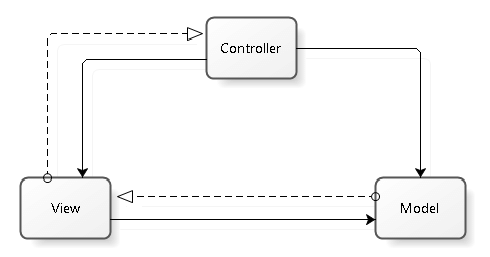

## Model–view–controller

Model–View–Controller (MVC) je obrazac softverske arhitekture. Koristi se u softverskom inženjeringu za odvajanje pojedinih dijelova aplikacije u komponente ovisno o njihovoj namjeni. Model se sastoji od podataka, poslovnih pravila, logike, i funkcija ugrađenih u programsku logiku (business logic). View, odnosno pogled, je bilo kakav prikaz podataka kao što je obrazac, tablica ili dijagram. Moguć je prikaz podataka kroz više različitih pogleda. Controller ili upravitelj prihvaća ulazne naputke (input) i pretvara ih u naloge modelu ili pogledu. Ovakva arhitektura olakšava nezavisan razvoj, testiranje i održavanje određene aplikacije.

### Opis

*Puna crta prikazuje direktnu povezanost dok isprekidana prikazuje indirektnu povezanost kroz promatrača*

MVC se sastoji od tri cjeline:
* **Model (Model)** - podaci i poslovna logika određene aplikacije
* **Pogled (View)** - prikaz predhodno modeliranih podataka
* **Upravitelj (Controller)** - upravlja korisničkim zahtjevima

### Međudjelovanje komponenata

Osim podjele aplikacije u tri vrste komponenti, Model-View-Controller (MVC) dizajn utvrđuje interakcije između njih.

* **Upravitelj** može slati naloge modelu kojima ažurira njegovo stanje (npr., uređivanje dokumenta). Također može slati naredbe u poglede kojima mijenja prikaz modela (npr., kretanje kroz dokument).
* **Model** dojavljuje sebi pridruženim pogledima i upraviteljima kada je došlo do promjene u njegovom stanju. Ove dojave omogućuju pogledu da prikaže obnovljeno stanje modela, a upravitelju promjenu dostupnog skup naredbi.
* **Pogled** zahtjeva od modela informacije potrebne za stvaranje prikaza modela korisniku.