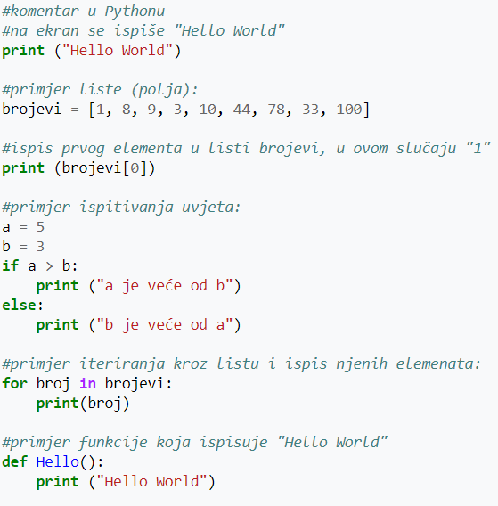
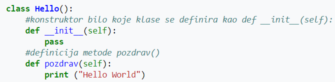

**Python** je programski jezik opće namjene, interpretiran i visoke razine kojeg je stvorio Guido van Rossum 1990. godine (prva javna inačica objavljena je u veljači 1991. godine),[1] ime dobiva po televizijskoj seriji Monty Python's Flying Circus. Po automatskoj memorijskoj alokaciji, Python je sličan programskim jezicima kao što su Perl, Ruby, Smalltalk itd. Python dopušta programerima korištenje nekoliko stilova programiranja. Objektno orijentirano, strukturno i aspektno orijentirano programiranje stilovi su dopušteni korištenjem Pythona te ova fleksibilnost čini Python programski jezik sve popularnijim. Python se najviše koristi na Linuxu, no postoje i inačice za druge operacijske sustave.

## Usporedba Pythona sa ostalim jezicima

Unutar IT zajednice česte su kritike Pythona na račun njegove sporosti. Pošto je Python interpreterski jezik, programi napisani u njemu vrše se malo sporije za usporedbu od kompajlerskih jezika, kao što su C, C++ i slični. Međutim, unatoč toj brzinskoj manjkavosti, u industriji se Python poprilično koristi (ponajviše kao back end programski jezik).ž

Python se često uspoređuje sa Javom. Oboje su interpreterski jezici, i oboje imaju gotovo nikakvu podršku za višejezgrovno izvođenje programa, pošto i Python i Java koriste samo jednu procesorsku jezgru. Java je kao jezik puno primjenjenija u izradi mobilnih aplikacija i interaktivnog web sadržaja, dok je Python gospodar PC svijeta. Što se tiče brzine izvođenja programa, Java i Python su približno jednaki.

## Uvlačenje

Python koristi uvlačenje kao metodu razlikovanja programskih blokova, tj. ne koristi vitičaste zagrade ili ključne riječi kao većina programskih jezika. Povećanje uvlačenja znači da dolazi novi, ugniježđeni blok, dok smanjenje označava kraj trenutnog bloka.

## Ključne riječi i kontrola toka

U Pythonove ključne riječi spadaju:
* *if* izraz, koji izvršava određeni blok koda pod nekim uvjetom, zajedno s *else* i *elif* (*else-if* varijanta).
* *for* izraz, koji iterira kroz iterabilan objekt i svaki element upisuje u lokalnu varijablu koja se koristi u pridruženom bloku.
* *while* izraz, koji izvršava određeni blok koda sve dok je njegov uvjet istinit
* *try* izraz, koji omogućava da iznimke, koje su bačene u bloku koda kojeg *try* obuhvaća, budu uhvaćene i obrađene u *except* bloku
* *class* izraz, kojim se deklarira klasa (u objektno orijentiranom programiranju)
* *def* izraz, koji definira funkciju ili metodu
* *assert* izraz, koji se koristi pri debuggiranju kako bi se provjerilo vrijede li određeni uvjeti
* *import* izraz, koji se koristi pri uključivanju dodatnih modula

## Primjer

Nekoliko primjera koji pokazuju sintaksu Pythona (inačica 3.x):

Primjer klase: 

